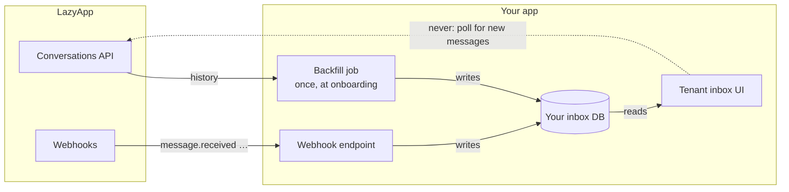

You want each customer to see and answer WhatsApp conversations inside your product. The architecture that scales: **webhooks write your inbox database; API calls are for sending, backfill, and embeds.**

## The model

Conversations belong to a customer's workspace. Scope them with a customer-scoped key or `X-LazyApp-Customer`:

```bash
curl "https://lazyapp.in/v1/conversations?limit=50" \
  -H "Authorization: Bearer $LAZYAPP_API_KEY" \
  -H "X-LazyApp-Customer: acct_8812"
```

List messages in a thread with [`GET /v1/conversations/{conversation}/messages`](/api-reference/conversations/list-messages-in-a-conversation). Free-form replies only work inside the [24-hour window](/sending/messages#the-24-hour-window); outside it, send a template.

<Info>
  Prefer shipping the [embedded inbox](/platform/embedded-components) if you do not need a fully custom UI. Mint a short-lived `inbox` token per page load.
</Info>

## Webhooks write your inbox, not polling

The list endpoints are for backfill — not for discovering new messages. Subscribe once on your platform workspace; events for every customer arrive with a `customer` envelope. Your tenant UIs read your database:



| Architecture | Standing API load with 500 tenants | New-message latency |
| --- | --- | --- |
| Poll each tenant's conversations every 30s | Huge — most responses empty | Up to 30s |
| Webhook-first | ~0 for discovery — budget goes to sends and backfills | Push, near-instant |

Handle these events:

| Event | What to update |
| --- | --- |
| `message.received` | Append inbound message, bump unread |
| `message.sent` / `delivered` / `read` / `played` | Update outbound status |
| `message.failed` | Show error inline so the tenant can retry |
| `connection.disconnected` | Prompt reconnect via [setup links](/platform/setup-links) |

### Routing an event to the right tenant

Platform deliveries include the customer:

```json
{
  "id": "evt_…",
  "type": "message.received",
  "customer": {
    "id": "cus_9f8b1c2d",
    "external_id": "acct_8812",
    "name": "Acme Retail"
  },
  "data": {
    "message": {
      "uuid": "…",
      "status": "…",
      "to": "+919812345670",
      "provider_message_id": "wamid.…"
    }
  }
}
```

Look up `customer.external_id` in your database. One endpoint serves every tenant:

```js Node
export async function POST(req) {
  const rawBody = await req.text();
  verifySignature(rawBody, req.headers.get('X-LazyApp-Signature'));

  const event = JSON.parse(rawBody);
  if (await alreadyProcessed(event.id)) {
    return Response.json({ ok: true });
  }

  // Ack quickly: enqueue, process on a worker
  await queue.enqueue(event);
  return Response.json({ ok: true });
}

async function handle(event) {
  const tenant = await tenantByExternalId(event.customer?.external_id);
  if (!tenant) return;

  switch (event.type) {
    case 'message.received':
      return db.appendInbound(tenant.id, event.data.message);
    case 'message.delivered':
    case 'message.read':
    case 'message.failed':
      return db.updateStatus(tenant.id, event.data.message);
  }
}
```

See [verifying](/webhooks/verifying) and the [retry schedule](/webhooks/overview) — miss the ack window and you get unnecessary redeliveries.

## Sending replies

Send with [`POST /v1/messages`](/sending/messages) scoped to the tenant. Quote the inbound message with `context.message_id` when you want a threaded reply.

```bash
curl https://lazyapp.in/v1/messages \
  -H "Authorization: Bearer $LAZYAPP_API_KEY" \
  -H "X-LazyApp-Customer: acct_8812" \
  -H "Content-Type: application/json" \
  -H "Idempotency-Key: reply-…" \
  -d '{
    "type": "text",
    "to": "+919812345670",
    "body": "Yes, that size is in stock.",
    "context": { "message_id": "wamid.…" }
  }'
```

The HTTP response means *accepted*, not *delivered* — status arrives through the same webhook stream.

If a tenant triggers a burst of sends, run it through a per-tenant queue. Rate limits apply to your key as a whole. On `429`, back off with the same Idempotency-Key.

## Polling is for backfill only

Two moments justify calling list endpoints:

- **Onboarding a tenant** — after `customer.connected`, page through conversations (and messages per thread) into your DB.
- **Reconciliation** — a periodic sweep to catch anything a missed webhook left behind.

## Checklist

- [ ] One webhook endpoint writes your inbox DB; ack fast, process async, dedupe by event `id`
- [ ] Route via `customer.external_id`
- [ ] Send replies through the API; trust webhooks for status
- [ ] Per-tenant queues for bursty sends; honour rate limits
- [ ] Poll only for onboarding backfill and reconciliation
- [ ] Consider the [embedded inbox](/platform/embedded-components) before rebuilding UI

## Related

- [Build a platform](/platform/overview) — customer model and webhook fan-out
- [Tenant messaging](/platform/messaging) — send path and idempotency
- [Embedded components](/platform/embedded-components) — drop-in inbox
- [Webhooks](/webhooks/overview) — delivery and signatures
- [Event reference](/webhooks/events) — message and connection events
