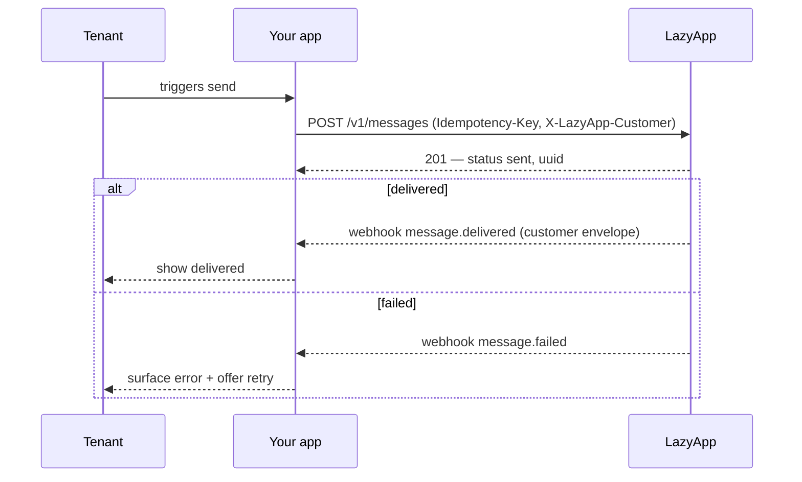

Messaging is the write path every tenant uses daily — and the surface where integration mistakes hurt most, because the failure mode is visible on *your customer's* WhatsApp number. The recipe: **create with an Idempotency-Key, upload media once, schedule with `send_at` instead of cron storms, and learn outcomes from webhooks.**

## Send on a tenant's behalf

You already have everything from the [core model](/platform/overview): the customer's id / `external_id`, and either a scoped key or a platform key. Send exactly as in the [quickstart](/quickstart), scoped to them:

<CodeGroup>
```bash cURL
curl https://lazyapp.in/v1/messages \
  -H "Authorization: Bearer $LAZYAPP_API_KEY" \
  -H "X-LazyApp-Customer: acct_8812" \
  -H "Content-Type: application/json" \
  -H "Idempotency-Key: 4b4986f4-77b5-4c22-a3a7-2c56f7a657e1" \
  -d '{
    "type": "template",
    "to": "+919812345670",
    "template": {
      "name": "appointment_reminder",
      "language": "en"
    }
  }'
```

```js Node
await fetch('https://lazyapp.in/v1/messages', {
  method: 'POST',
  headers: {
    Authorization: `Bearer ${process.env.LAZYAPP_API_KEY}`,
    'X-LazyApp-Customer': customer.externalId,
    'Content-Type': 'application/json',
    'Idempotency-Key': crypto.randomUUID(), // reuse on retry — see below
  },
  body: JSON.stringify({
    type: 'template',
    to: '+919812345670',
    template: { name: 'appointment_reminder', language: 'en' },
  }),
});
```

```python Python
requests.post(
    "https://lazyapp.in/v1/messages",
    headers={
        "Authorization": f"Bearer {os.environ['LAZYAPP_API_KEY']}",
        "X-LazyApp-Customer": customer.external_id,
        "Idempotency-Key": str(uuid.uuid4()),  # reuse on retry
    },
    json={
        "type": "template",
        "to": "+919812345670",
        "template": {"name": "appointment_reminder", "language": "en"},
    },
)
```
</CodeGroup>

<Warning>
  **Tenant isolation on send is your job when using a platform key.** The key can act for any customer you pass in `X-LazyApp-Customer`. Only ever set that header (or use a scoped key) for the tenant that owns the action.
</Warning>

Outside the 24-hour window you must send a [template](/sending/templates). Check `service_window` on [`GET /v1/contacts/{contact}`](/sending/messages#service-window) before choosing text vs template.

## Make creation retry-safe

Your tenants' messages flow through queues, workflow tools, and mobile clients that all retry on timeouts — and a duplicate WhatsApp message goes to *their* contact, not yours.

Use the [`Idempotency-Key` header](/concepts/idempotency) on every write:

| Layer | Keyed on | On replay |
| --- | --- | --- |
| `Idempotency-Key` header | The UUID you send | Same status and body, with `Idempotency-Replayed: true` |
| Optional body `idempotency_key` | Domain-level dedupe on the message row | Refuses a second send with the same key |

The working recipe: generate a fresh UUID per *logical* send, reuse the **same** UUID when retrying that exact call, and treat a replayed response as success.

## Upload media once, reference it everywhere

Upload with [`POST /v1/media`](/sending/media) (or `POST /v1/media/url`), then pass `media_id` on the message. Two multi-tenant rules keep this efficient:

- **One upload per asset.** A tenant sending the same PDF to many contacts reuses one `media_id`.
- **Scope uploads to the tenant.** Use the scoped key or `X-LazyApp-Customer` so media lands in *their* workspace — otherwise you cannot attach it to their send.

## Schedule without cron storms

The tempting design — your scheduler fires every tenant's 9:00 reminders with immediate sends at 9:00 sharp — creates a thundering herd against your rate limit and Meta's pacing.

Prefer LazyApp scheduling: set `send_at` (and optional `ttl_seconds`) so each message is accepted as `202` and released when due:

```json
{
  "type": "template",
  "to": "+919812345670",
  "template": { "name": "appointment_reminder", "language": "en" },
  "send_at": "2026-09-02T09:00:00+05:30",
  "ttl_seconds": 3600
}
```

| Instead of | Do this |
| --- | --- |
| Firing every tenant's sends at `:00` from your cron | `send_at` per message — LazyApp releases them when due |
| A create-message loop with no backoff for a CSV import | A worker with a concurrency cap; honour `429` |
| Polling for delivery | [Webhooks](/webhooks/overview) |

For bulk template sends to a segment, use [broadcasts](/sending/broadcasts) — LazyApp paces them to the number's messaging tier.

## Outcomes come from webhooks

The create response means *accepted* — `status: "sent"` (or a scheduled id for `202`). What happens next arrives on [message webhooks](/webhooks/events#messages):



Route events via `customer.external_id`, then update your UI from status:

| Status / event | Show the tenant |
| --- | --- |
| `sent` / `message.sent` | Accepted by WhatsApp |
| `message.delivered` | Reached the device |
| `message.read` / `message.played` | Opened / voice played |
| `message.failed` | The error, with a retry action |

You can also [`GET /v1/messages/{uuid}`](/api-reference/messages/retrieve-a-message) for confirmation — prefer webhooks in production.

<Info>
  Don't poll conversations or messages to discover status changes. Webhooks push the outcome; polling is only for reconciliation.
</Info>

## Checklist

- [ ] Scope every send with a customer key or `X-LazyApp-Customer` for the right tenant
- [ ] Fresh `Idempotency-Key` per logical send; same UUID on retries
- [ ] Templates outside the 24-hour window; check `service_window` when you can
- [ ] Upload media in the tenant's workspace; reuse `media_id`
- [ ] Prefer `send_at` / broadcasts over synchronized cron storms
- [ ] Status from webhooks routed by `customer.external_id` — not from polling

## Related

- [Build a platform](/platform/overview) — customer-per-tenant model
- [Messages](/sending/messages) — types and the service window
- [Idempotency](/concepts/idempotency) — header behaviour in depth
- [Broadcasts](/sending/broadcasts) — paced segment sends
- [Webhooks](/webhooks/overview) — delivery and signatures
