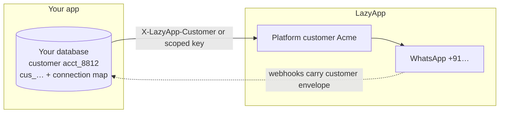
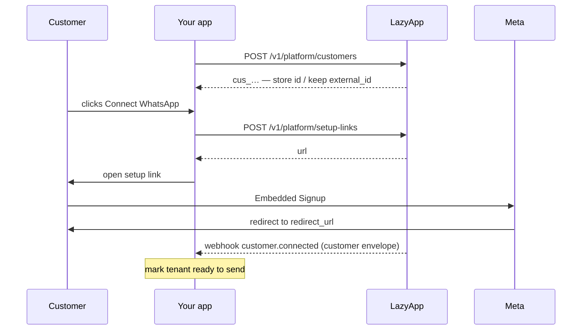

If you're building WhatsApp into your own product, each customer brings their own Business Account. LazyApp's tenant boundary for this is the **platform customer**: one isolated workspace per customer, their connection inside it, and your database holding the mapping via `external_id`.

This page covers the core model. Once it's in place, the recipes show how to build features on top without fighting rate limits:

<CardGroup cols={3}>
  <Card title="Tenant messaging" icon="paper-plane" href="/platform/messaging">
    Retry-safe sends for every customer: idempotency, templates, scheduling
  </Card>
  <Card title="Tenant usage dashboards" icon="chart-line" href="/platform/usage">
    Show each customer their consumption and cost from the usage API
  </Card>
  <Card title="Tenant inbox" icon="inbox" href="/platform/inbox">
    Conversations per customer: webhook-first, replies, embeds
  </Card>
</CardGroup>

Requests flow one way, events flow back — and your database is what connects the two:



Your own workspace stays separate. Create one platform customer per of *their* customers alongside it.

---

## Step 1: Create a customer per tenant

When a customer signs up in your app, create their LazyApp customer and store the returned `id` (or just keep using your own `external_id` — LazyApp accepts either).

<CodeGroup>
```bash cURL
curl https://lazyapp.in/v1/platform/customers \
  -H "Authorization: Bearer $LAZYAPP_API_KEY" \
  -H "Content-Type: application/json" \
  -d '{
    "name": "Acme Retail",
    "external_id": "acct_8812",
    "billing_mode": "postpaid",
    "markup_bps": 1500
  }'
```

```js Node
const response = await fetch('https://lazyapp.in/v1/platform/customers', {
  method: 'POST',
  headers: {
    Authorization: `Bearer ${process.env.LAZYAPP_API_KEY}`,
    'Content-Type': 'application/json',
  },
  body: JSON.stringify({
    name: 'Acme Retail',
    external_id: 'acct_8812',
    billing_mode: 'postpaid',
    markup_bps: 1500,
  }),
});

const customer = await response.json();
// Store customer.id (cus_…) — or keep looking them up by external_id
```

```python Python
customer = requests.post(
    "https://lazyapp.in/v1/platform/customers",
    headers={"Authorization": f"Bearer {os.environ['LAZYAPP_API_KEY']}"},
    json={
        "name": "Acme Retail",
        "external_id": "acct_8812",
        "billing_mode": "postpaid",
        "markup_bps": 1500,
    },
).json()
# Store customer["id"] — or keep looking them up by external_id
```
</CodeGroup>

`external_id` is your own account id, so you never need a mapping table. Look them up later with `GET /v1/platform/customers?external_id=acct_8812`. `markup_bps` is your margin in basis points — 1500 is 15%.

See [Create a customer](/api-reference/platform/create-a-customer) for all fields.

---

## Step 2: Let them connect WhatsApp

Create a [setup link](/platform/setup-links) so they connect through Meta's Embedded Signup. You never handle their credentials.

```bash
curl https://lazyapp.in/v1/platform/setup-links \
  -H "Authorization: Bearer $LAZYAPP_API_KEY" \
  -H "Content-Type: application/json" \
  -d '{
    "customer_id": "cus_9f8b1c2d",
    "expires_in_days": 7,
    "redirect_url": "https://yourapp.example/settings/whatsapp?connected=1"
  }'
# → { "url": "https://lazyapp.in/connect/set_…", … }
```

Hand `url` to your customer — email it, or put it behind a **Connect WhatsApp** button.

Subscribe to [`customer.connected`](/webhooks/events#platform) to learn about new connections server-side. Platform deliveries include a `customer` envelope with your `external_id`:

```json
{
  "id": "evt_…",
  "type": "customer.connected",
  "created_at": "2026-09-01T12:00:00+00:00",
  "customer": {
    "id": "cus_9f8b1c2d",
    "external_id": "acct_8812",
    "name": "Acme Retail"
  },
  "data": { }
}
```

Also handle `setup_link.failed` and `connection.attention_required` / `connection.disconnected` so you can prompt a reconnect.

The whole onboarding flow, end to end:



Do not trust the redirect alone — it is UX only. Confirm from the webhook. Details in [setup links](/platform/setup-links).

---

## Step 3: Send on their behalf

Two patterns. Pick one:

| Pattern | How | When |
| --- | --- | --- |
| Customer-scoped key | Mint once, store the key, call `/v1` as that customer | Dedicated backend per tenant, or long-lived agent |
| Platform key + header | One key, pass `X-LazyApp-Customer` on every request | Single integration that fans out to many tenants |

### Mint a scoped key

```bash
curl https://lazyapp.in/v1/platform/customers/cus_9f8b1c2d/api-keys \
  -H "Authorization: Bearer $LAZYAPP_API_KEY" \
  -H "Content-Type: application/json" \
  -d '{
    "name": "Acme server",
    "scopes": ["messages:send", "messages:read"]
  }'
```

That key can only see that customer's workspace. Omit `scopes` to grant the defaults for a customer-scoped key.

### Or act with the platform key

```bash
curl https://lazyapp.in/v1/messages \
  -H "Authorization: Bearer $LAZYAPP_API_KEY" \
  -H "X-LazyApp-Customer: acct_8812" \
  -H "Content-Type: application/json" \
  -H "Idempotency-Key: order-1042-shipped" \
  -d '{
    "type": "template",
    "to": "+919812345670",
    "template": { "name": "order_shipped", "language": "en" }
  }'
```

`X-LazyApp-Customer` accepts `public_id`, `uuid`, or `external_id`. The key needs `customers:act` (send only) or `customers:write` (full management). See [Authentication](/authentication#acting-for-a-platform-customer).

The messaging recipe covers idempotency, templates, and scheduling: [Tenant messaging](/platform/messaging).

---

## Step 4: Route webhooks back to the right customer

Webhook endpoints are configured once on your platform workspace, not per customer. Register one endpoint and route internally.

Every event that originated in a customer's workspace is also delivered to your platform endpoints, with a `customer` envelope:

| Events | Tenant key | Look it up in |
| --- | --- | --- |
| Message, template, OTP, contact, connection, … | `customer.external_id` (or `customer.id`) | Your customer record |
| `customer.connected` / `setup_link.failed` | Same envelope | Mark onboarding complete / failed |
| `customer.usage_alert` | Same envelope | Notify that tenant about spend |

See [Webhooks](/webhooks/overview) for delivery, retries, and signature verification, and [Tenant inbox](/platform/inbox) for a full handler sketch.

---

## Rate limits with many tenants

One platform API key is enough for your whole integration. LazyApp limits **per key** (120 requests/minute by default — see [rate limits](/reference/rate-limits)). Meta separately caps how many unique contacts a number may message in 24 hours; that limit is per connection, reported on [`GET /v1/capabilities`](/concepts/capabilities).

That budget serves all your tenants together, which has three practical consequences:

- **Prefer webhooks over polling.** Most per-tenant "is there anything new?" traffic disappears when webhooks push events to you.
- **Run background work as one smooth queue.** A sync worker with a small concurrency cap uses the budget steadily. Per-tenant cron jobs that all fire at `:00` create bursts.
- **Fairness between tenants is yours to enforce.** LazyApp limits your key, not your customers — if one tenant triggers a huge burst, queue it so it cannot starve everyone else.

When you get a `429`, back off and retry with the same [Idempotency-Key](/concepts/idempotency). Handle `402` distinctly: spending limit or wallet exhausted for that customer (or your platform billing) — alert, don't retry blindly.

---

## Monitor connection health

WhatsApp credentials fail: Meta reviews, quality issues, or a customer reconnects elsewhere. Build the reconnect loop up front:

1. Subscribe to `connection.attention_required` and `connection.disconnected` — platform deliveries include the `customer` envelope.
2. Prompt that customer to reconnect with a new [setup link](/platform/setup-links) (`allowed_connection_type: "reconnect"`).
3. As a safety net, periodically call [`GET /v1/capabilities`](/concepts/capabilities) with `X-LazyApp-Customer` (or a scoped key) to catch anything a webhook missed.

---

## Billing modes

| Mode | Meaning |
| --- | --- |
| `inherit` | Billed on your account, as your own usage |
| `prepaid` | Draws down a wallet balance. Sending stops at zero |
| `postpaid` | Accrues and is invoiced |

Set `spending_limit_cents` to cap a customer, and `usage_alert_cents` to receive `customer.usage_alert` before they hit it. Read consumption with [`GET /v1/platform/customers/{customer}/usage`](/platform/usage).

---

## Offboarding a customer

| Action | Effect |
| --- | --- |
| `POST …/suspend` | Blocks sending immediately, keeps everything. Reversible. |
| `POST …/archive` | Retires a workspace you may want back. Reversible. |
| `DELETE …` | Erases the workspace. Irreversible — prefer archive. |
| `POST …/restore` | Undoes suspend or archive. |

---

## Embedding UI

Rather than rebuilding an inbox, drop LazyApp components into your product with short-lived, origin-locked tokens. See [embedded components](/platform/embedded-components).

---

## Related

- [Tenant messaging](/platform/messaging) — retry-safe sends per customer
- [Tenant usage](/platform/usage) — per-customer consumption dashboards
- [Tenant inbox](/platform/inbox) — webhook-first conversations
- [Setup links](/platform/setup-links) — Embedded Signup
- [Idempotency](/concepts/idempotency) — safe retries
- [Rate limits](/reference/rate-limits) — windows and backoff
- [Webhooks](/webhooks/overview) — delivery and signatures
