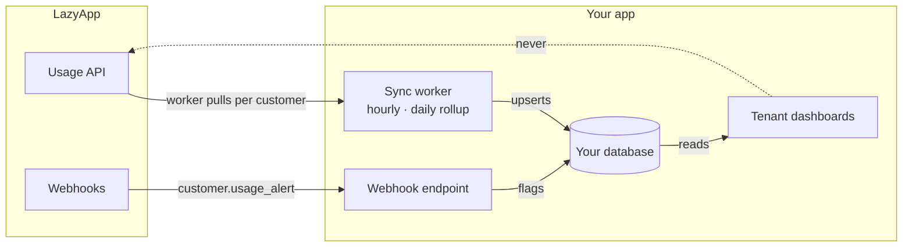

You want each of your customers to open a dashboard in your app and see *their* numbers: messages sent, spend, and how close they are to a limit. LazyApp does not expose Instagram-style post engagement analytics — WhatsApp usage and billing are the metrics that matter here.

## Every usage read is already tenant-scoped

[`GET /v1/platform/customers/{customer}/usage`](/api-reference/platform/retrieve-customer-usage) returns that customer's workspace consumption for a billing period (`YYYY-MM`). Pass your platform key; no extra header is required because the customer is in the path.

```bash
curl "https://lazyapp.in/v1/platform/customers/cus_9f8b1c2d/usage?period=2026-09" \
  -H "Authorization: Bearer $LAZYAPP_API_KEY"
```

The payload includes totals, markup, wallet / spending limit fields, and the breakdown for that workspace. The customer show payload also embeds a light `usage` summary for the current month.

List customers via [`GET /v1/platform/customers`](/api-reference/platform/list-customers) when you need a portfolio view.

## Don't proxy every dashboard render to the API

The tempting architecture — every widget on your customer's billing page calls LazyApp on load — burns your [per-key rate limit](/reference/rate-limits) and returns data that only changes when messages send.

The pattern that works: **serve dashboards from your own database, and refresh it with a background sync worker** (plus webhooks for alerts):



## The sync-worker pattern

One worker with a small concurrency cap, iterating your tenants:

| Tier | Cadence | Why |
| --- | --- | --- |
| Hot | Hourly | Current month totals for active tenants |
| Rollup | Daily | Archive completed months, catch missed hours |
| On demand | When the tenant opens billing | Optional single refresh if the last sync is stale |

On a `429`, wait and retry. With a concurrency cap of ~5 you will rarely see one at the default 120 req/min ceiling.

Subscribe to [`customer.usage_alert`](/webhooks/events#platform) so a tenant approaching `usage_alert_cents` is flagged without polling.

## Show limits, not fake real-time

Surface what the API gives you:

| Field | Use |
| --- | --- |
| Period message count / charge | Primary chart |
| `marked_up_total` / `markup_bps` | What you bill the tenant |
| `wallet_balance_cents` | Prepaid remaining |
| `spending_limit_cents` | Cap before sends refuse with `402` |
| `customer.usage_alert` webhook | Proactive warning in your UI |

Sends that hit the wallet or spending limit return `402` — handle that in the [messaging](/platform/messaging) path so the tenant sees a clear upgrade / top-up prompt.

## Checklist

- [ ] Dashboards read from your database; a worker fills usage
- [ ] Path-scoped `GET …/usage` per customer; portfolio list when needed
- [ ] `customer.usage_alert` webhook for threshold crossings
- [ ] Handle `402` on send as a billing state, not a transient error
- [ ] Don't invent social engagement charts — this product is WhatsApp usage

## Related

- [Build a platform](/platform/overview) — billing modes and lifecycle
- [Tenant messaging](/platform/messaging) — where `402` shows up on send
- [Rate limits](/reference/rate-limits) — per-key budget
- [Webhooks](/webhooks/events#platform) — usage alert event
